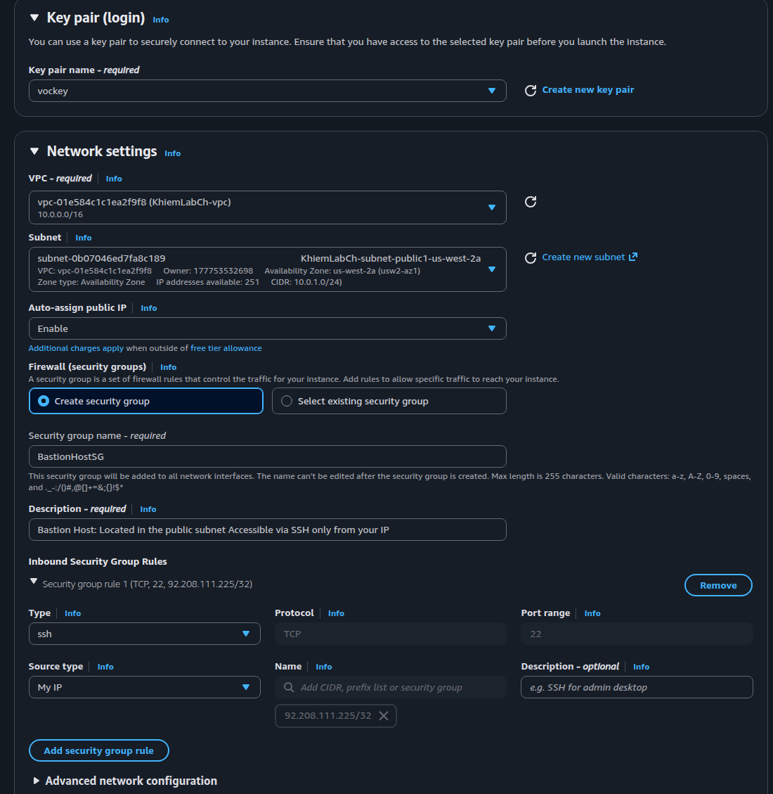
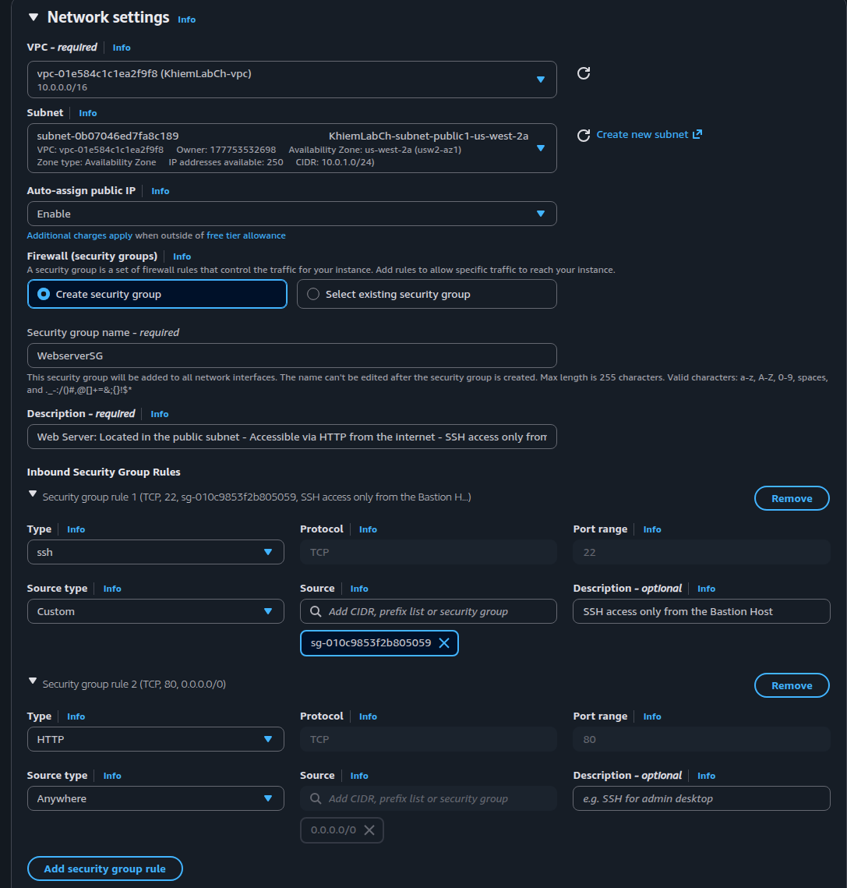
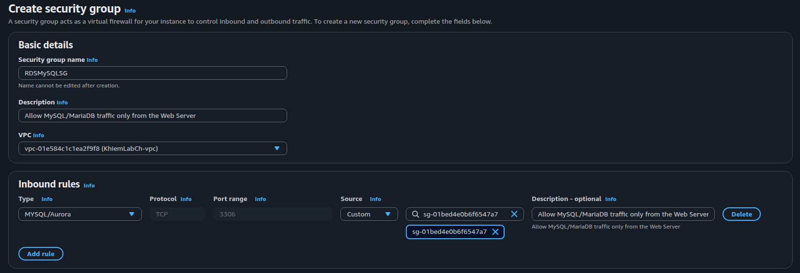
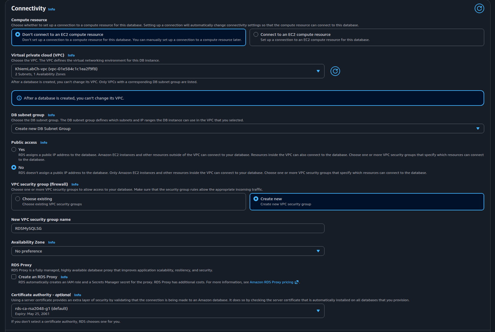
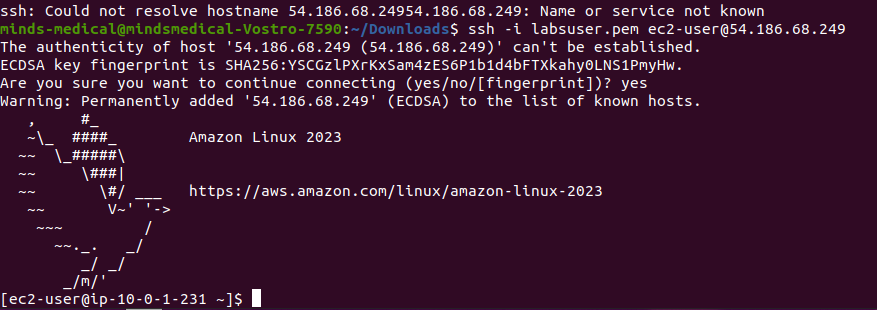
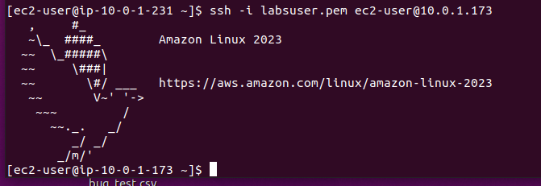

## Step-by Step AWS Challenge Task

### Networking  
Requirements  
Create a custom VPC (e.g., CIDR: 10.0.0.0/16) 
Create two subnets: 
PublicSubnet (e.g., 10.0.1.0/24) 
PrivateSubnet (e.g., 10.0.2.0/24) 
Attach an Internet Gateway to the VPC 
Configure route tables: 
Public subnet should route to the Internet Gateway 
Private subnet should not have internet access 
Associate each subnet with the appropriate route table 
## 1. Creating VPC with 2 Subnets

## 2. VPC Resource Map

## 3. Creating Batsion Host
Bastion Host:  
Located in the public subnet 
Accessible via SSH only from your IP 

## 4. Creating WebServer
Web Server:  
Located in the public subnet 
Accessible via HTTP from the internet 
SSH access only from the Bastion Host 

# 5. Create a SG for RDS
RDS: Allow MySQL/MariaDB traffic only from the Web Server

# 6. Creating RDS MySQL DB
Deploy a MySQL or MariaDB RDS instance in the private subnet  
RDS should only allow inbound traffic on port 3306 from the Web Server  

## 6.a Setting Network for DB

## 6.b. Troubleshooting: ERROR
An error occured while creating the DB instance 
Fix: Use connect to EC2 instance (WebServer)

# 7. Access to Bastion Server via terminal
Acces with terminal with ssh and public-key.pem

# 8. Connect to Webserver from Bastion server via SSH

IMPORTANT !!! Use private ipAdress 

# 9. Access to DB
Install mysql on EC2. Look in internet with updated installation

Access DB with your Credentials
