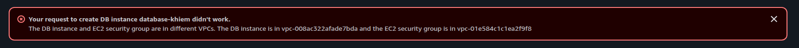
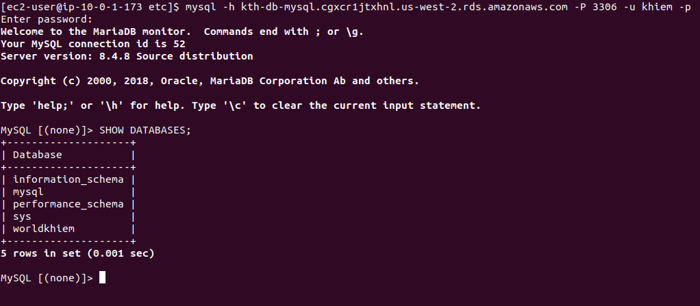

1. Creating VPC with 2 Subnets

2. Showcase VPC Resource Map

3. Creating Bation host

4. Creating WebsServer

5. Create a SG for RDS

6. Creating RDS MySQL DB

6. Setting Network

6. a.

7. Access to Bastion Server via terminal

8. Connect to Webserver from Bastion server via SSH

use private ipadress

Accessto DB
